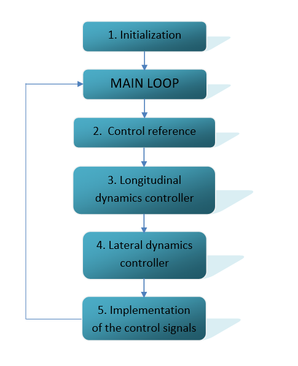

#Trajectory Tracking System in Matlab 
Trajectory Tracking System in Matlab using Driving Scenario Designer, YALMIP and IBM CPLEX solver

-to run the software successfully, you need to install: 
	1.[MATLAB] (https://www.mathworks.com/downloads/)
	2.[YALMIP] (https://yalmip.github.io/tutorial/installation/)
	3.[IBM CPLEX solver](https://www.ibm.com/products/ilog-cplex-optimization-studio?mhsrc=ibmsearch_p&mhq=IBM%20ILOG%20CPLEX%20Optimization%20Studio%20V12.9.0)

-whole simulation starts when you run the "MAIN_SCRIPT" script

-the program logic scheme: 

-all scripts and functions are described in comments

-in the "RESULTS.mat" workspace final results can be found

-with the "plotting_function" you can check the results individually

*NOTE: Because of the slow YALMIP response, you may need to run the script a few times to get good results.

